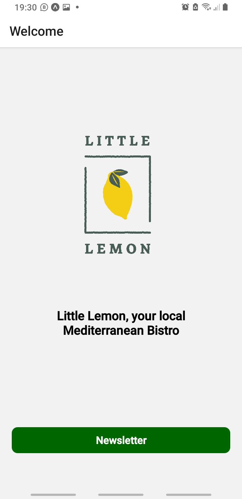
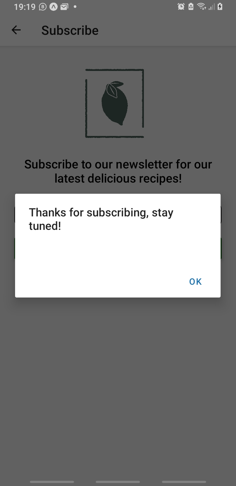

# Little-Lemon-newsletter-sign-up
Made with React Native

# DELETABLE FOLDERS

.expo

node_modules

# Steps to reproduce:
## 1. USING YARN

-> yarn install

-> yarn expo install expo-asset@~8.6.3 react-native@0.69.9

-> yarn expo start

Then plug your Android device and Run in Android

› Opening on Android...
√ Select a device/emulator » SM_G965F (device)
› Opening exp://192.168.50.182:19000 on SM_G965F
› Press ? │ show all commands
Android Bundling complete 20856ms

Should be able to download any Bundling on its own

## 2. USING EXPO CLI

-> npm install -g expo-cli

-> yarn install

-> npx expo install expo-asset@~8.6.3 react-native@0.69.9

Then plug your Android device and Run in Android

Logs for your project will appear below. Press Ctrl+C to exit.
› Opening on Android...
› Opening exp://192.168.50.182:19000 on SM_G965F
› Press ? │ show all commands
Started Metro Bundler
› Opening on Android...
› Opening exp://192.168.50.182:19000 on SM_G965F
› Press ? │ show all commands
Android Bundling complete 22146ms
Android Running app on SM-G965F

# SCREENSHOTS:

 

# TROUBLESHOOTING:

If errors encountered during screen loading, try to swipe off previous screens on your Android device and restart Expo again

